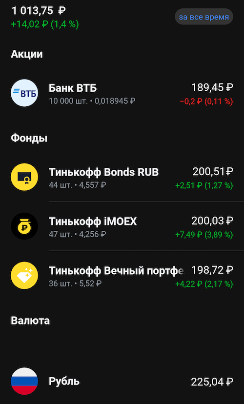

# Торговый бот балансировщик
Этот бот участвует в конкурсе [Tinkoff Invest Robot Contest](https://github.com/Tinkoff/invest-robot-contest).

Appname: suenot

### Требования
**ВАЖНО**: Работает только с рублевыми акциями и фондами. Других инструментов для корректной работы находиться на счету не должно.

Простой балансировщик портфелей.
- Получает реальный портфель на счете.
- Приводит его к желаемому портфелю.
    Пример желаемого портфеля:
    ```js
    export const DESIRED_WALLET: DesiredWallet = {
      TMOS: 25, // 25% Тинькофф iMOEX (TMOS)
      RUB: 25, // 25% Рублей
      TBRU: 25, // 25% Тинькофф Bonds
      TRUR: 25, // 25% Тинькофф Вечный портфель (TRUR)
    };
    ```
- Выставляет необходимые для балансировки ордера на покупку и продажу. Пока это рыночные ордера.
- Цикл повторяется
### Пример балансировки


1000 рублей были сбалансированы на:
  - 20% Тинькофф iMOEX (TMOS)
  - 20% Рублей
  - 20% Тинькофф Вечный 
  - 20% Акции ВТБ
### Настройки
Для работы бота вам необходимо [получить токен](https://www.tinkoff.ru/invest/settings).

ACCOUNT_ID это цифровое значение, которое можно получить по API, либо можете указать ACCOUNT_ID=BROKER для использования брокерского счета или ACCOUNT_ID=ISS для использования счета ИИС.

Требуется счет только с рублевыми активами и создать .env файл с настройками
```bash
TOKEN=
ACCOUNT_ID=
```

Желаемые настройки портфеля в процентах и перерыв между балансировками настраиваются в `./src/config.js`:
```js
export const desiredWallet: DesiredWallet = {
  TMOS: 25, // 25% Тинькофф iMOEX (TMOS)
  RUB: 25, // 25% Рублей
  TRUR: 50, // 50% Тинькофф Вечный портфель (TRUR)
};

export const balancerInterval: number = 60000; // Раз в минуту
```
### Запуск
```
npm i
npm run start
```

### Дополнительно

Изначально к конкурсу готовился [бот с ассоциативной структурой данных](https://github.com/suenot/deep-tinkoff-invest), но из-за нехватки времени решил взять задачу попроще.
