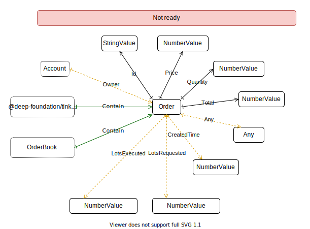
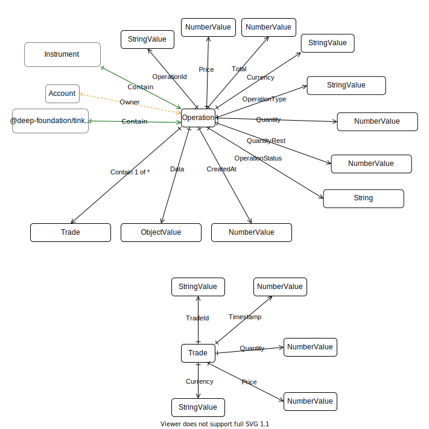

# Deep-tinkoff-invest-api package
This package is work in progress.

### Instrument

Tinkoff invest api methods:
- [GetInstrumentBy](https://tinkoff.github.io/investAPI/instruments/#getinstrumentby)
- [Shares](https://tinkoff.github.io/investAPI/instruments/#shares)
- [Etfs](https://tinkoff.github.io/investAPI/instruments/#etfs)

### Position

Tinkoff invest api methods:
- [GetPositions](https://tinkoff.github.io/investAPI/operations/#getpositions)

### Candle

Tinkoff invest api methods:
- [GetCandles](https://tinkoff.github.io/investAPI/marketdata/#getcandles)

### Order

Tinkoff invest api methods:
- [GetOrderBook](https://tinkoff.github.io/investAPI/marketdata/#getorderbook)

### Trade

Tinkoff invest api methods:
- [GetTrades](https://tinkoff.github.io/investAPI/marketdata/#getlasttrades)
