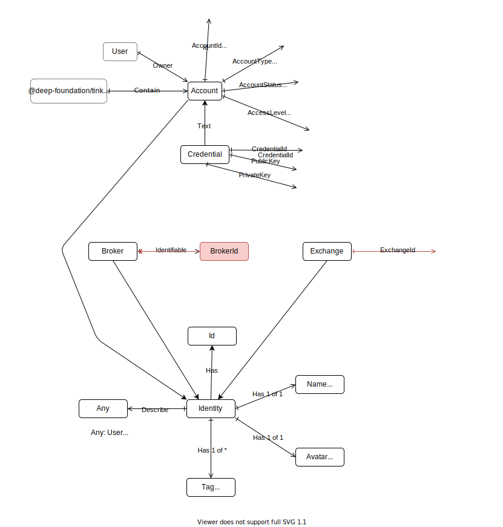
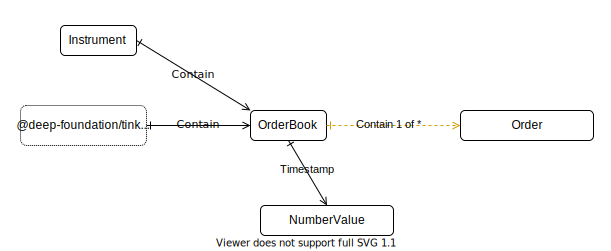
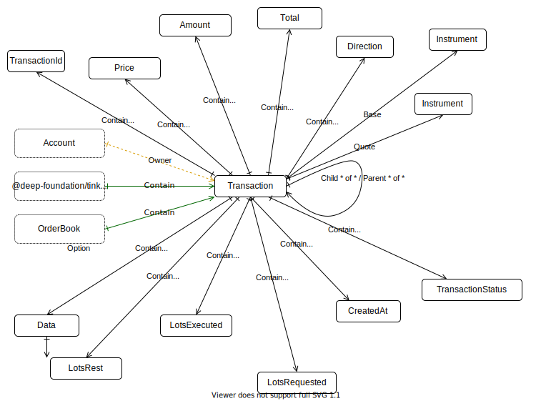

# Deep-tinkoff-invest-api package
This package is work in progress.

### Account

Tinkoff invest api methods:
- [GetAccounts](https://tinkoff.github.io/investAPI/users/#getaccounts)

### Instrument

Tinkoff invest api methods:
- [GetInstrumentBy](https://tinkoff.github.io/investAPI/instruments/#getinstrumentby)
- [Shares](https://tinkoff.github.io/investAPI/instruments/#shares)
- [Etfs](https://tinkoff.github.io/investAPI/instruments/#etfs)

### Position

Tinkoff invest api methods:
- [GetPositions](https://tinkoff.github.io/investAPI/operations/#getpositions)

### Candle

Tinkoff invest api methods:
- [GetCandles](https://tinkoff.github.io/investAPI/marketdata/#getcandles)

### OrderBook

Tinkoff invest api methods:
- [GetOrderBook](https://tinkoff.github.io/investAPI/marketdata/#getorderbook)

### Transaction
Trades from the marker and from users are the same stucture.
Operations, Orders and Trades are one union structure - Transaction.

Tinkoff invest api methods:
- [GetLastTrades](https://tinkoff.github.io/investAPI/marketdata/#getlasttrades) - Метод запроса последних обезличенных сделок по инструменту.
- [GetOperations](https://tinkoff.github.io/investAPI/operations/#getoperations) - Метод получения списка операций по счёту.

#### Order
Orders from the marker and from users are the same stucture.

Tinkoff invest api methods:
- [PostOrder](https://tinkoff.github.io/investAPI/orders/#postorder)
- [CancelOrder](https://tinkoff.github.io/investAPI/orders/#cancelorder)
- [GetOrderState](https://tinkoff.github.io/investAPI/orders/#getorderstate)
- [GetOrders](https://tinkoff.github.io/investAPI/orders/#getorders)

